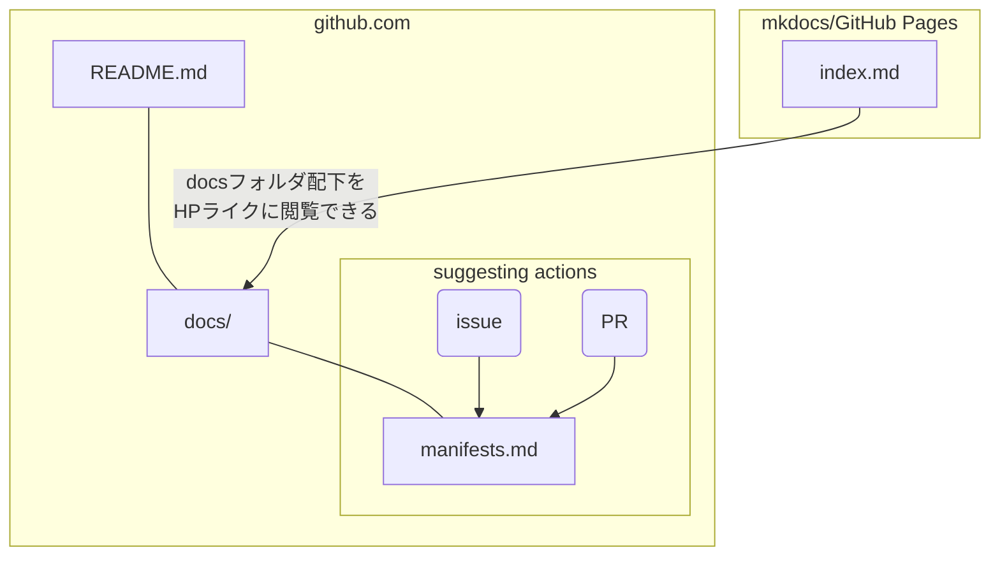

# 注意事項
* 以下は、安野たかひろが2024年東京都知事選に出馬した際のReadmeを参考のために残しているものです。
* フォークしてご利用の際は、用途に合わせて適宜修正ください（安野たかひろについての内容が残らないよう注意してご利用ください）。

---
---


# (Sample)開発者・利用者向けREADME

トップページのREADMEは有権者が訪れるため、本リポジトリを用いて意見聴取や制作管理を行いたい開発者・利用者向けのREADMEはこちらに記載します。

## リポジトリの構造

```
|   .gitignore
|   LICENSE
|   mkdocs.yml （mkdocs内のページ構造を制御）
|   README.md （リポジトリを見に来てくれた有権者向けREADME）
|   requirements.txt （mkdocs関連のバージョン設定）
|   
+---.github （GitHubに関する設定ファイル）
|   |   DEVELOPERS.md
|   |   requirements.txt （スクリプト関連のバージョン設定）
|   |   
|   +---developer
|   |       initialize_qdrant_collection.py
|   |       local_deploy.md （ローカル開発ガイド）
|   |       README.md （リポジトリ全体の構造や使い方について説明：このページ）
|   |       
|   +---ISSUE_TEMPLATE （issueテンプレートの設定ファイル）
|   |       manifest_issue_template.yaml
|   |       
|   +---PULL_REQUEST_TEMPLATE （PRテンプレートの設定ファイル）
|   |       manifest_pull_request_template.md
|   |       
|   +---scripts （モデレート機能の設定ファイル）
|   |       .env.example
|   |       README.md
|   |       review_issue.py
|   |       
|   \---workflows （ワークフロー系機能の設定ファイル）
|           add-label.yml
|           comment-review.yml
|           issue-review.yml
|           main.yml
|           
+---docs （この中身がmkdocs上HPとして公開されます。ディレクトリ構造は mkdocs.yml で設定）
|   |   CNAME
|   |   contribution.md
|   |   index.md
|   |   manual_issue.md
|   |   manual_pull_request.md
|   |   
|   +---images
|   |       editing_manifest.png
|   |       fork_button.png
|   |       get_started.png
|   |       new_comment.png
|   |       new_issue.png
|   |       pencil_button.png
|   |       select_manifest.png
|   |       sign_in_and_up.png
|   |       
|   \---manifest
\---overrides
        main.html
```

## 利用者の導線



- GitHub.comだけでも完結できます、GitHubのUIに慣れていない人向けに、mkdocsを用いて作成したHPでdocsフォルダ以下の内容を確認することができます。
    - GitHub Pagesで公開可能です
- ただし、issueを立てる、PRを出すといった行動はGitHub.com内でしかすることができません。
- `README.md`と`index.md`は置かれている位置が異なるが同じ内容となるように記載するのが望ましいです。
    - `README.md`はGitHubのトップに置かれますが、`index.md`はdocsフォルダのトップに置かなければなりません。
    - いずれもそれぞれの導線におけるトップページとなるため、同一内容のトップページを二カ所に置く必要が生じています。

## デプロイ方法

- ローカル環境の立ち上げは[こちら](\local_deploy.md)を参照
- mkdocsによるHPの立ち上げ方法は[公式ドキュメント](https://www.mkdocs.org/user-guide/deploying-your-docs/)をご覧ください。
    - GitHub Pagesでの公開は可能な[アカウントプランに制限](https://docs.github.com/ja/pages/getting-started-with-github-pages/about-github-pages)があるためご注意ください。

## Tips

- マニフェスト本体以外の部分（特に、有権者に対するご案内の部分）については公開当時のまま残しております。
    - 利用用途に応じて、編集してご利用ください。
